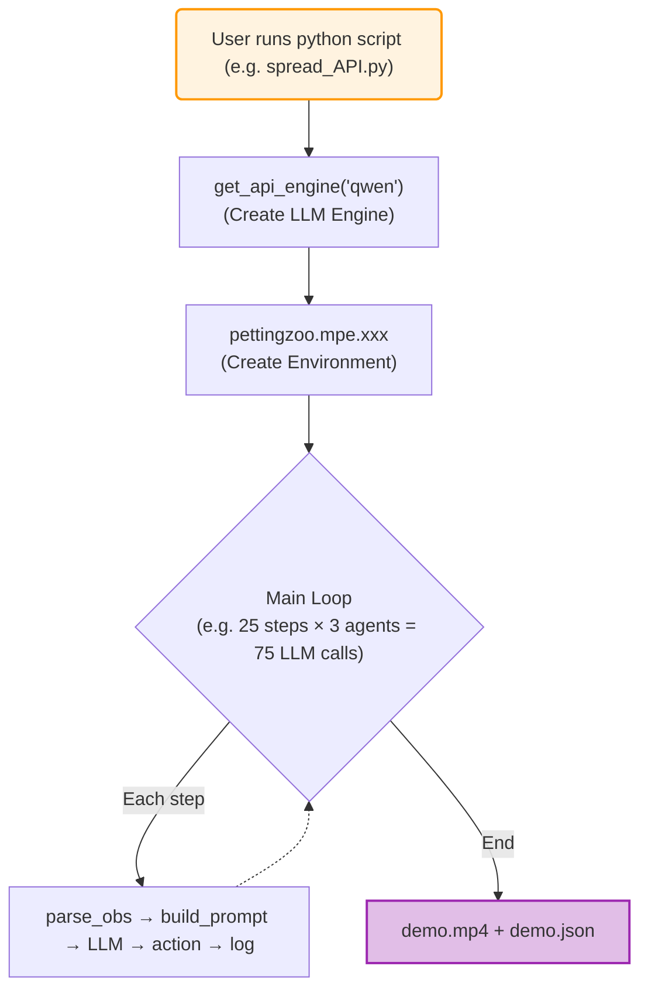

# System Architecture

## Directory Structure

```
MPE_muiltiagent_benchmark/
├── 📂 prompt/                    # Prompt modules (one file per game)
│   └── prompt_for_xxx.py         #   Exports 4 standard functions
├── 📂 obs/                       # Observation parsers (numpy → dict)
│   └── parse_xxx_obs.py
├── 📄 utils_api.py               # Unified inference engine
├── 📄 benchmark_runner.py        # Batch evaluation script
└── 🎮 *.py                       # 9 game scripts
```

## Core Components

### 1. Inference Engine (`utils_api.py`)

```python
engine = get_api_engine("qwen")     # Remote API
engine = get_api_engine("ollama", model_name="qwen2.5:7b")  # Local model
```

### 2. Observation Parsers (`obs/`)

Convert raw numpy arrays to labeled dictionaries:

```python
def parse_simple_obs(obs):
    return {
        "vel": [obs[0], obs[1]],
        "landmark_rel": [obs[2], obs[3]],
    }
```

### 3. Prompt Modules (`prompt/`)

Each game has 4 standardized functions:
- `get_task_and_reward()` — Game rules and reward formulas
- `get_physics_rules()` — Physics engine parameters
- `get_action_and_response_format()` — Action dimensions and JSON format
- `get_navigation_hints()` — Navigation strategy and few-shot examples

### 4. Game Scripts

All follow the same loop pattern:

**Single Step Execution Flow:**

```mermaid
flowchart TD
    A["① PettingZoo Env"] -->|raw observation (numpy)| B["② Obs Parser (parse_xxx_obs)"]
    B -->|structured dict {vel, pos...}| C["③ Prompt Builder (user_prompt_xxx)"]
    C -->|user_prompt (string) - Tasks+Physics+Action+Nav| D["④ LLM Engine (generate_action)"]
    D -->|JSON response {'action':[], 'notes':...}| E["⑤ Post-process (np.clip)"]
    E -->|clipped action [0,1]^5| F["⑥ env.step(actions)"]
    F -->|new obs, rewards, done| G["⑦ Log & Render"]
    
    style A fill:#e1f5fe,stroke:#03a9f4,stroke-width:2px
    style G fill:#e8f5e9,stroke:#4caf50,stroke-width:2px
```

```python
for step in range(MAX_STEPS):
    for agent_id in env.agents:
        obs_struct = parse_xxx_obs(observations[agent_id])
        full_prompt = user_prompt_xxx(agent_id, step, obs_struct)
        action_vec, thought = llm_engine.generate_action(sys_prompt, full_prompt)
        actions[agent_id] = np.clip(action_vec, 0.0, 1.0)
    observations, rewards, _, _, _ = env.step(actions)
```

**Data Flow Diagram:**



## API Key Configuration

Priority order:
1. **Direct parameter** — `get_api_engine("deepseek", api_key="sk-xxx")`
2. **Environment variable** — `export DEEPSEEK_API_KEY="sk-xxx"`
3. **`.env` file** — Create `.env` in project root (recommended)
