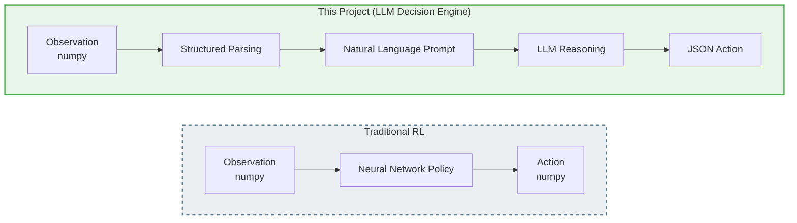

# Project Overview

## What is MPE Multi-Agent Benchmark?

MPE Multi-Agent Benchmark is an LLM-based multi-agent benchmark suite built on **PettingZoo MPE (Multi-agent Particle Environment)**. It uses Large Language Models directly as agent "decision brains" for **zero-shot** reasoning across 9 classic multi-agent game scenarios.

## Core Idea

Traditional RL: `observation → neural network → action`

This project: `observation → structured parsing → natural language prompt → LLM reasoning → JSON action`

This allows direct evaluation of LLM capabilities in:
- **Spatial reasoning** — understanding coordinates, distances, directions
- **Game-theoretic decision making** — cooperation and competition
- **Communication coordination** — establishing and following protocols
- **Strategic planning** — long-term strategy formulation and execution

## Supported LLM Backends

### Remote APIs

| Provider | Name | Environment Variable |
|:---------|:----:|:---------------------|
| OpenAI | `openai` | `OPENAI_API_KEY` |
| DeepSeek | `deepseek` | `DEEPSEEK_API_KEY` |
| Qwen | `qwen` | `QWEN_API_KEY` |
| Google Gemini | `gemini` | `GOOGLE_API_KEY` |

### Local Models

| Framework | Name | Config |
|:----------|:----:|:-------|
| Ollama | `ollama` | `model_name` (e.g., `qwen2.5:7b`) |
| Transformers | `transformers` | `model_path`, `device` |
| vLLM | `vllm` | `model_path` |

## Key Features

- **Modular Prompt System** — 4 standardized modules per game
- **Complete Logging** — JSON logs + MP4 videos per episode
- **Batch Evaluation** — `benchmark_runner.py` with multi-seed, multi-episode support
- **Unified API** — `APIInferencer` class works across all providers
