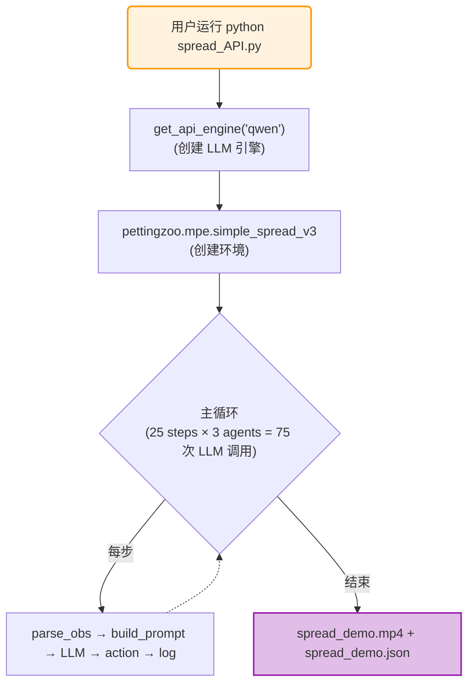

# 系统架构

## 目录结构

```
MPE_muiltiagent_benchmark/
│
├── 📂 prompt/                          # 提示词模块 (每个游戏一个文件)
│   ├── prompt_for_simple.py            #   每个文件导出 4 个标准函数
│   ├── prompt_for_spread.py
│   ├── prompt_for_adv.py
│   ├── prompt_for_push.py
│   ├── prompt_for_tag.py
│   ├── prompt_for_crypto.py
│   ├── prompt_for_reference.py
│   ├── prompt_for_speaker_listener.py
│   └── prompt_for_world_comm.py
│
├── 📂 obs/                             # 观测解析器 (numpy → dict)
│   ├── parse_simple_obs.py
│   ├── parse_spread_obs.py
│   ├── parse_adv_obs.py
│   ├── parse_push_obs.py
│   ├── parse_tag_obs.py
│   ├── parse_crypto_obs.py
│   ├── parse_reference_obs.py
│   ├── parse_speaker_listener_obs.py
│   └── parse_world_comm_obs.py
│
├── 📄 utils_api.py                     # 统一推理引擎
├── 📄 benchmark_runner.py              # 批量评测脚本
│
├── 🎮 simple.py                        # 9 个游戏主脚本
├── 🎮 spread_API.py
├── 🎮 adv_API.py
├── 🎮 push.py
├── 🎮 tag_API.py
├── 🎮 crypto.py
├── 🎮 reference.py
├── 🎮 speaker_listener.py
└── 🎮 world_comm.py
```

## 核心组件

### 1. 推理引擎 (`utils_api.py`)

`utils_api.py` 是整个系统的核心，提供了统一的 LLM 推理接口。

#### `get_api_engine(provider, **kwargs)` 工厂函数

根据 `provider` 参数创建对应的推理引擎：

```python
# 远程 API
engine = get_api_engine("qwen")          # 通义千问
engine = get_api_engine("deepseek")      # DeepSeek
engine = get_api_engine("openai")        # GPT-4o 等
engine = get_api_engine("gemini")        # Google Gemini

# 本地模型
engine = get_api_engine("ollama", model_name="qwen2.5:7b")
engine = get_api_engine("transformers", model_path="Qwen/Qwen2.5-7B-Instruct")
engine = get_api_engine("vllm", model_path="Qwen/Qwen2.5-7B-Instruct")
```

#### `APIInferencer` 类

统一的推理调用接口：

```python
class APIInferencer:
    def __init__(self, client, model_name, provider):
        ...
    
    def generate_action(self, system_prompt: str, user_prompt: str) -> tuple[list, str]:
        """
        调用 LLM 生成动作。
        
        Args:
            system_prompt: 系统角色提示词
            user_prompt: 包含观测信息的用户提示词
        
        Returns:
            action: 浮点数列表 [a0, a1, a2, a3, a4]
            thought: LLM 的思考过程（notes 字段）
        """
```

### 2. 观测解析器 (`obs/`)

每个游戏有一个对应的解析器，将 PettingZoo 返回的原始 numpy 数组转换为结构化字典：

```python
# obs/parse_simple_obs.py
def parse_simple_obs(obs: np.ndarray) -> dict:
    return {
        "vel": [obs[0], obs[1]],           # 自身速度
        "landmark_rel": [obs[2], obs[3]],  # 地标相对位置
    }
```

**为什么需要解析器？** 
- LLM 无法理解原始 numpy 数组的含义
- 解析器赋予每个维度明确的语义标签
- 结构化数据更适合嵌入到自然语言提示词中

### 3. 提示词模块 (`prompt/`)

每个游戏的提示词由 4 个标准函数组成：

```python
# prompt/prompt_for_xxx.py
def get_task_and_reward(**kwargs) -> str:
    """游戏规则、角色目标、奖励公式"""

def get_physics_rules(**kwargs) -> str:
    """物理引擎参数：dt, 阻尼, 质量, 碰撞判定"""

def get_action_and_response_format(**kwargs) -> str:
    """动作维度、JSON 输出格式、few-shot 示例"""

def get_navigation_hints(**kwargs) -> str:
    """坐标理解、边界处理、角色策略"""
```

### 4. 游戏主脚本

每个游戏脚本 (`simple.py`, `spread_API.py` 等) 都遵循相同的主循环模式。

## 单步执行流程

下图展示了每一步的完整执行流程：

```mermaid
flowchart TD
    A["① PettingZoo Env"] -->|raw observation (numpy)| B["② Obs Parser (parse_xxx_obs)"]
    B -->|structured dict {vel, pos...}| C["③ Prompt Builder (user_prompt_xxx)"]
    C -->|user_prompt (string) - 包含任务+物理+动作+导航| D["④ LLM Engine (generate_action)"]
    D -->|JSON response {'action':[], 'notes':...}| E["⑤ Post-process (np.clip)"]
    E -->|clipped action [0,1]^5| F["⑥ env.step(actions)"]
    F -->|new obs, rewards, done| G["⑦ Log & Render"]
    
    style A fill:#e1f5fe,stroke:#03a9f4,stroke-width:2px
    style G fill:#e8f5e9,stroke:#4caf50,stroke-width:2px
```

**代码示例**（简化版）：

```python
for step in range(MAX_STEPS):
    for agent_id in env.agents:
        # ① 获取观测
        raw_obs = observations[agent_id]
        
        # ② 解析观测
        obs_struct = parse_xxx_obs(raw_obs)
        
        # ③ 组装提示词
        full_prompt = user_prompt_xxx(agent_id, step, obs_struct)
        
        # ④ LLM 推理
        action_vec, thought = llm_engine.generate_action(sys_prompt, full_prompt)
        
        # ⑤ 裁剪动作
        actions[agent_id] = np.clip(action_vec, 0.0, 1.0)
    
    # ⑥ 环境步进
    observations, rewards, terminated, truncated, infos = env.step(actions)
    
    # ⑦ 记录日志
    log_entry = {
        "step": step,
        "agent": agent_id,
        "observation": obs_struct,
        "action": action_vec,
        "thought": thought,
        "reward": rewards[agent_id]
    }
```

## API Key 配置机制

`utils_api.py` 支持三种 API Key 配置方式，按优先级排列：

1. **直接传参**（最高优先级）

```python
engine = get_api_engine("deepseek", api_key="sk-xxx", base_url="https://...")
```

2. **环境变量**

```bash
export DEEPSEEK_API_KEY="sk-xxx"
export QWEN_API_KEY="sk-xxx"
```

3. **`.env` 文件**（推荐）

```env
# 项目根目录下创建 .env 文件
DEEPSEEK_API_KEY=sk-xxx
QWEN_API_KEY=sk-xxx
OPENAI_API_KEY=sk-xxx
GOOGLE_API_KEY=xxx
```

系统会在启动时自动加载 `.env` 文件中的变量。

## 数据流向图


