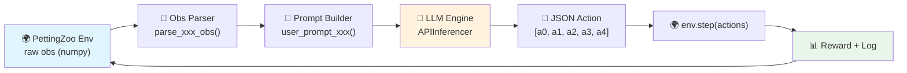
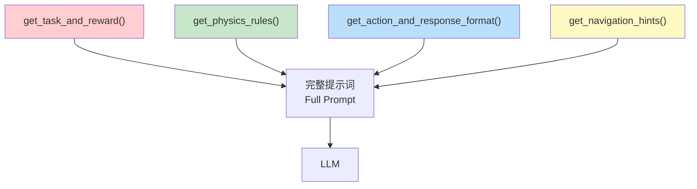

<](https://pettingzoo.farama.org/)
[](https://python.org)
[](LICENSE)

<!-- 🖼️ PLACEHOLDER: 项目主横幅图 / Project Banner Image -->
<!--  -->
<!-- 建议放置: 一张包含多个游戏截图拼接的横幅图, 尺寸 1200x400 -->

[English](#english-version) · [中文](#中文版本) · [Quick Start](#-快速开始--quick-start) · [Games](#-游戏环境总览--game-environments-overview)

</div>

---

<a name="中文版本"></a>

# 📖 中文文档

## 目录

- [项目概述](#-项目概述)
- [系统架构](#-系统架构)
- [游戏环境总览](#-游戏环境总览)
- [各游戏详解](#-各游戏详解)
  - [1. Simple (导航)](#1-simple--导航)
  - [2. Spread (协作覆盖)](#2-spread--协作覆盖)
  - [3. Adversary (欺骗与推理)](#3-adversary--欺骗与推理)
  - [4. Push (对抗推挤)](#4-push--对抗推挤)
  - [5. Tag (追逐捕获)](#5-tag--追逐捕获)
  - [6. Crypto (加密通信)](#6-crypto--加密通信)
  - [7. Reference (多任务通信)](#7-reference--多任务通信)
  - [8. Speaker-Listener (单向通信)](#8-speaker-listener--单向通信)
  - [9. World Comm (大规模协调)](#9-world-comm--大规模协调)
- [提示词工程](#-提示词工程)
- [快速开始](#-快速开始)
- [Benchmark 批量评测](#-benchmark-批量评测)
- [实验结果](#-实验结果)

---

## 🌟 项目概述

本项目是一个基于 **PettingZoo MPE (Multi-agent Particle Environment)** 的 LLM 多智能体基准测试套件。它将大语言模型（LLM）直接作为智能体的「决策大脑」，在 9 个经典的多智能体博弈场景中进行零样本（zero-shot）推理决策。

**核心思想**：将传统 RL 中由神经网络策略完成的 "观测 → 动作" 映射，替换为 "观测 → 自然语言提示词 → LLM 推理 → JSON 动作输出"。

<!-- 🖼️ PLACEHOLDER: 核心流程图 / Core Pipeline Diagram -->
<!--  -->
<!-- 建议放置: 一张展示 Observation → Prompt → LLM → Action → Env Step 的流程图 -->
<!-- 尺寸建议: 900x300, SVG 或 PNG 格式 -->

### 主要特性

| 特性 | 说明 |
|:---:|:---|
| 🎯 **9 个游戏环境** | 覆盖协作、对抗、通信、欺骗等多种博弈范式 |
| 🤖 **多 LLM 后端** | 支持 DeepSeek / Qwen / GPT / Gemini / Ollama / Transformers / vLLM |
| 📊 **结构化输出** | 每轮保存 JSON 日志（观测、思维链、动作、奖励）和 MP4 视频 |
| 🧩 **模块化提示词** | 每个游戏解耦为 4 大模块：任务目标、物理规则、动作格式、导航策略 |
| 🔄 **批量评测** | `benchmark_runner.py` 支持多轮次 (N episodes) + 多种子 + 跨环境汇总统计 |

---

## 🏗️ 系统架构

```
MPE_muiltiagent_benchmark/
│
├── 📂 prompt/                      # 提示词模块 (每个游戏一个文件)
│   ├── prompt_for_simple.py        #   → 4 个函数: task, physics, action, hints
│   ├── prompt_for_spread.py
│   ├── prompt_for_adv.py
│   ├── prompt_for_push.py
│   ├── prompt_for_tag.py
│   ├── prompt_for_crypto.py
│   ├── prompt_for_reference.py
│   ├── prompt_for_speaker_listener.py
│   └── prompt_for_world_comm.py
│
├── 📂 obs/                         # 观测解析器 (raw → structured dict)
│   ├── parse_simple_obs.py
│   ├── parse_spread_obs.py
│   ├── parse_adv_obs.py
│   ├── parse_push_obs.py
│   ├── parse_tag_obs.py
│   ├── parse_crypto_obs.py
│   ├── parse_reference_obs.py
│   ├── parse_speaker_listener_obs.py
│   └── parse_world_comm_obs.py
│
├── 📄 utils_api.py                 # 统一推理引擎 (APIInferencer + get_api_engine)
├── 📄 benchmark_runner.py          # 批量评测脚本 (N episodes × 9 games)
│
├── 🎮 simple.py                    # 游戏主脚本 ×9
├── 🎮 spread_API.py
├── 🎮 adv_API.py
├── 🎮 push.py
├── 🎮 tag_API.py
├── 🎮 crypto.py
├── 🎮 reference.py
├── 🎮 speaker_listener.py
└── 🎮 world_comm.py
```

### 单步执行流程



每个游戏脚本都遵循相同的主循环模式：

```python
for step in range(MAX_STEPS):
    for agent_id in env.agents:
        obs_struct = parse_xxx_obs(observations[agent_id])  # ① 解析观测
        full_prompt = user_prompt_xxx(agent_id, step, obs_struct)  # ② 组装提示词
        action_vec, thought = llm_engine.generate_action(sys_prompt, full_prompt)  # ③ LLM 推理
        actions[agent_id] = np.clip(action_vec, 0.0, 1.0)  # ④ 裁剪动作
    observations, rewards, _, _, _ = env.step(actions)  # ⑤ 环境步进
```

---

## 🎮 游戏环境总览

<!-- 🖼️ PLACEHOLDER: 游戏截图合集 / Game Screenshots Collage -->
<!--  -->
<!-- 建议放置: 3×3 九宫格, 每格一个游戏的截图, 带游戏名标注 -->
<!-- 尺寸建议: 1200x1200 -->

| # | 游戏 | 类型 | 智能体 | 核心挑战 | 通信 |
|:-:|:-----|:-----|:------:|:---------|:----:|
| 1 | **Simple** | 导航 | 1 | 单智能体导航到地标 | ✗ |
| 2 | **Spread** | 协作 | N (默认 3) | 多智能体覆盖多地标 + 避碰 | ✗ |
| 3 | **Adversary** | 对抗 | 1 Adv + N Good | 欺骗：Good 迷惑 Adv，Adv 推理目标 | ✗ |
| 4 | **Push** | 对抗 | 1 Adv + 1 Good | 物理推挤阻截 vs 冲刺到达目标 | ✗ |
| 5 | **Tag** | 追逐 | 3 Pred + 1 Prey | 合作追捕 vs 逃跑 | ✗ |
| 6 | **Crypto** | 通信 | Alice + Bob + Eve | 信息加密传输 vs 窃听破译 | ✓ |
| 7 | **Reference** | 通信 | 2 (互为说/听者) | 观察伙伴目标 → 广播信号 → 听信号导航 | ✓ |
| 8 | **Speaker-Listener** | 通信 | 1 Speaker + 1 Listener | 单向通信：说者传目标，听者导航 | ✓ |
| 9 | **World Comm** | 大规模 | 4 Adv + 2 Prey | Leader 广播猎物坐标，Hunter 协同追捕 | ✓ |

---

## 📋 各游戏详解

---

### 1. Simple | 导航

<!-- 🎬 PLACEHOLDER: Simple 游戏演示视频 / Simple Game Demo Video -->
<!--  -->
<!-- 或者使用 GIF:  -->
<!-- 放置位置: 放在本节标题下方, 尺寸建议 400x400 -->

**环境名称**: `simple_v3` | **PettingZoo 模块**: `pettingzoo.mpe.simple_v3`

#### 🎯 游戏目标

单个智能体移动至单个地标位置。

#### 👁️ 观测空间

| 字段 | 维度 | 含义 |
|:-----|:----:|:-----|
| `vel` | 2 | 自身速度 `[vx, vy]` |
| `landmark_rel` | 3 | 地标相对位置 `[dx, dy, distance]` |

> **观测语义**: `obs = [vel_x, vel_y, dx, dy]`，其中 `(dx, dy) = landmark_pos - agent_pos`。

#### 💰 奖励函数

```
reward = -‖agent_pos - landmark_pos‖² = -(dx² + dy²)
```

距离越近，奖励越高（最大为 0）。

#### 🕹️ 动作空间

| 索引 | 含义 | 取值范围 |
|:----:|:-----|:-------:|
| `a[0]` | 无操作 (No-Op) | [0, 1] |
| `a[1]` | 左推力 (Left) | [0, 1] |
| `a[2]` | 右推力 (Right) | [0, 1] |
| `a[3]` | 下推力 (Down) | [0, 1] |
| `a[4]` | 上推力 (Up) | [0, 1] |

**净力**: `F_x = (a[2] - a[1]) × sensitivity`, `F_y = (a[4] - a[3]) × sensitivity`

<!-- 📊 PLACEHOLDER: Simple 实验结果表格 / Simple Experiment Results Table -->
<!-- 建议内容: 不同 LLM 的平均奖励对比表 -->
<!--
| Model | Mean Reward | Std Dev | Episodes |
|:------|:----------:|:-------:|:--------:|
| Qwen-3-Max | -0.xxx | ±0.xxx | 5 |
| DeepSeek-Chat | -0.xxx | ±0.xxx | 5 |
| GPT-4o | -0.xxx | ±0.xxx | 5 |
-->

---

### 2. Spread | 协作覆盖

<!-- 🎬 PLACEHOLDER: Spread 游戏演示视频 -->
<!--  -->

**环境名称**: `simple_spread_v3` | **智能体数**: N (默认 3)

#### 🎯 游戏目标

N 个智能体协作覆盖 N 个地标，同时避免碰撞。

#### 👁️ 观测空间

| 字段 | 维度 | 含义 |
|:-----|:----:|:-----|
| `self_vel` | 2 | 自身速度 |
| `self_pos` | 2 | 自身位置 |
| `landmark_rel` | 2×N | 各地标相对位置 `(landmark - self)` |
| `other_agent_rel` | 2×(N-1) | 其他智能体相对位置 |
| `comm` | 2×(N-1) | 其他智能体通信信号 (通常为 0) |

#### 💰 奖励函数

```
global_reward = -Σ_landmark min_agent ‖agent - landmark‖
local_reward  = -1.0  (每次碰撞)
total_reward  = global × (1 - local_ratio) + local × local_ratio
```

其中 **碰撞判定**: `dist(agent_i, agent_j) < size_i + size_j` (size = 0.15)。

> `local_ratio` 默认为 0.5，用于平衡全局覆盖和局部避碰。

#### 🕹️ 动作空间

与 Simple 相同的 5 维连续力向量 `[no_op, left, right, down, up]`。

<!-- 📊 PLACEHOLDER: Spread 实验结果表格 -->

---

### 3. Adversary | 欺骗与推理

<!-- 🎬 PLACEHOLDER: Adversary 游戏演示视频 -->
<!--  -->

**环境名称**: `simple_adversary_v3` | **智能体**: 1 Adversary + N Good Agents (默认 3)

#### 🎯 游戏目标

- **Good Agents (绿色)**: 知道目标地标，需要占领目标且**欺骗** Adversary 去错误的地标。策略：分兵 — 一人冲目标，一人做诱饵。
- **Adversary (红色)**: 不知道哪个是目标，需要通过**观察** Good Agents 的行为推理出目标。

#### 👁️ 观测空间

**Good Agent 观测**:

| 字段 | 含义 |
|:-----|:-----|
| `vel` | 自身速度 |
| `goal` | 目标地标相对位置 + 距离 |
| `landmarks[]` | 所有地标相对位置 |
| `adversary` | 对手相对位置 + 距离 |
| `teammates[]` | 队友相对位置 |

**Adversary 观测**:

| 字段 | 含义 |
|:-----|:-----|
| `vel` | 自身速度 |
| `landmarks[]` | 所有地标相对位置 (不知道哪个是目标) |
| `good_agents[]` | 所有 Good Agent 相对位置 |

#### 💰 奖励函数

**零和博弈**:
- Good Agents: 希望 Adversary **远离**真实目标
- Adversary: 希望自己**靠近**真实目标

<!-- 📊 PLACEHOLDER: Adversary 实验结果表格 -->

---

### 4. Push | 对抗推挤

<!-- 🎬 PLACEHOLDER: Push 游戏演示视频 -->
<!--  -->

**环境名称**: `simple_push_v3` | **智能体**: 1 Adversary + 1 Good Agent

#### 🎯 游戏目标

- **Good Agent (Runner)**: 冲到**真实目标**地标（有一个假地标干扰）。
- **Adversary (Blocker)**: 阻止 Good Agent 到达目标。Adversary 看到两个地标但不知道哪个是真的，需要从 Good Agent 的运动中推断。

#### 👁️ 观测空间

**Good Agent 观测**:

| 字段 | 含义 |
|:-----|:-----|
| `vel`, `speed` | 自身运动状态 |
| `goal_rel`, `goal_dist` | 真实目标相对位置及距离 |
| `fake_rel`, `fake_dist` | 假目标相对位置及距离 |
| `opponent_rel`, `opponent_dist` | 对手相对位置及距离 |

**Adversary 观测**:

| 字段 | 含义 |
|:-----|:-----|
| `vel`, `speed` | 自身运动状态 |
| `landmarks[]` | 两个地标的相对位置（不知道真假） |
| `opponent_rel`, `opponent_dist` | Good Agent 相对位置 |

#### 💰 奖励函数

- **Good Agent**: 接近真实目标时奖励增加
- **Adversary**: Good Agent 远离目标时奖励增加
- **物理特性**: Adversary 质量更大，碰撞时可以推开 Good Agent

<!-- 📊 PLACEHOLDER: Push 实验结果表格 -->

---

### 5. Tag | 追逐捕获

<!-- 🎬 PLACEHOLDER: Tag 游戏演示视频 -->
<!--  -->

**环境名称**: `simple_tag_v3` | **智能体**: 3 Predator + 1 Prey + 2 Obstacles

#### 🎯 游戏目标

- **Predator (🔴 狼)**: 合作追捕猎物，物理碰撞即成功。
- **Prey (🟢 羊)**: 利用障碍物逃跑，保持在边界内。

#### 👁️ 观测空间

| 字段 | Predator | Prey |
|:-----|:--------:|:----:|
| `self_vel`, `self_pos` | ✓ | ✓ |
| `obstacles_rel[]` | ✓ (障碍物) | ✓ (障碍物) |
| `enemies[]` | ✓ (猎物位置) | ✓ (捕食者位置) |
| `teammates[]` | ✓ (其他捕食者) | ✗ |

#### 💰 奖励函数

| 角色 | 条件 | 奖励 |
|:----:|:-----|:----:|
| Predator | 碰撞猎物 | **+10.0** |
| Predator | 每步距离惩罚 | **-0.1** × dist |
| Prey | 被捕获 | **-10.0** |
| Prey | 出界 | **-1.0** / step |
| Prey | 安全存活 | **+0.1** / step |

> **关键不对称**: 猎物的加速度比捕食者高，因此捕食者必须协同包围。

<!-- 📊 PLACEHOLDER: Tag 实验结果表格 -->

---

### 6. Crypto | 加密通信

<!-- 🎬 PLACEHOLDER: Crypto 游戏演示视频 -->
<!--  -->

**环境名称**: `simple_crypto_v3` | **智能体**: Alice + Bob + Eve

#### 🎯 游戏目标

- **Alice (加密者)**: 将秘密消息 M 与密钥 K 混合，输出密文 C 给 Bob。
- **Bob (解密者)**: 用共享密钥 K 还原出原始消息 M。
- **Eve (窃听者)**: 仅凭密文 C 猜测消息 M（没有密钥）。

#### 👁️ 观测空间

| 角色 | 观测内容 |
|:----:|:---------|
| Alice | 消息 M (4维) + 密钥 K (4维) |
| Bob | 密钥 K (4维) + 密文 C (上一步 Alice 的输出) |
| Eve | 密文 C (上一步 Alice 的输出) |

#### 💰 奖励函数

- **Alice & Bob**: Bob 正确还原消息时奖励高，Eve 猜对时奖励低
- **Eve**: 猜测越接近真实消息，奖励越高

**动作空间**: 4 维连续向量 `[v1, v2, v3, v4]` ∈ [0, 1]

> **注意**: MPE 中 Bob 看到的密文是 Alice **上一步**发出的（延迟一帧）。

<!-- 📊 PLACEHOLDER: Crypto 实验结果表格 -->

---

### 7. Reference | 多任务通信

<!-- 🎬 PLACEHOLDER: Reference 游戏演示视频 -->
<!--  -->

**环境名称**: `simple_reference_v3` | **智能体**: 2 个 (互为说者/听者)

#### 🎯 游戏目标

每个智能体既是说者又是听者。每个智能体观察到**对方的目标地标颜色**，需要通过通信帮助对方导航。

#### 👁️ 观测空间

| 字段 | 维度 | 含义 |
|:-----|:----:|:-----|
| `vel` | 2 | 自身速度 |
| `landmarks` | 3×2 | 3 个地标相对位置 |
| `partner_goal_rgb` | 3 | 对方目标的 RGB 颜色 |
| `partner_target_id` | 1 | 推断出的对方目标 ID |
| `heard_signal` | - | 接收到的通信信号 |

**动作空间**: 15 维 = 5 (运动) + 10 (通信信号)

<!-- 📊 PLACEHOLDER: Reference 实验结果表格 -->

---

### 8. Speaker-Listener | 单向通信

<!-- 🎬 PLACEHOLDER: Speaker-Listener 游戏演示视频 -->
<!--  -->

**环境名称**: `simple_speaker_listener_v4` | **智能体**: 1 Speaker + 1 Listener

#### 🎯 游戏目标

- **Speaker**: 看到目标地标 (one-hot 向量)，需要通过 3 维通信信号告诉 Listener。
- **Listener**: 看不到目标，但能看到地标位置。根据 Speaker 传来的信号导航到目标。

#### 👁️ 观测空间

**Speaker**:

| 字段 | 含义 |
|:-----|:-----|
| `goal_vector` | 目标地标 one-hot (3维) |
| `target_landmark_id` | 目标 ID |

**Listener**:

| 字段 | 含义 |
|:-----|:-----|
| `vel` | 自身速度 |
| `landmarks[]` | 3 个地标相对位置 |
| `comm_vector` | 接收的 3 维通信信号 |
| `heard_id` | 推断的目标 ID |

**Speaker 动作**: 3 维 (通信信号) | **Listener 动作**: 5 维 (运动)

<!-- 📊 PLACEHOLDER: Speaker-Listener 实验结果表格 -->

---

### 9. World Comm | 大规模协调

<!-- 🎬 PLACEHOLDER: World Comm 游戏演示视频 -->
<!--  -->

**环境名称**: `simple_world_comm_v3` | **智能体**: 4 Adversary (1 Leader + 3 Hunter) + 2 Prey

#### 🎯 游戏目标

最复杂的环境。包含食物、森林、障碍物。

| 角色 | 目标 |
|:----:|:-----|
| **Leader** | 全局感知猎物位置并广播坐标给 Hunter |
| **Hunter** | 根据 Leader 的信号或自身观测追捕猎物 |
| **Prey** | 逃避所有 Hunter，寻找食物 |

#### 👁️ 观测空间

| 字段 | Leader | Hunter | Prey |
|:-----|:------:|:------:|:----:|
| `position`, `velocity` | ✓ | ✓ | ✓ |
| `enemies` (猎物/威胁) | ✓ | ✓ | ✓ |
| `teammates` | ✓ (hunters) | ✗ | ✓ (partner) |
| `communication` | ✗ (发送者) | ✓ (接收) | ✗ |
| `landmarks` | ✓ | ✓ | ✓ |

**Leader 动作**: 9 维 = 5 (运动) + 4 (通信: Prey0_X, Prey0_Y, Prey1_X, Prey1_Y)
**Hunter/Prey 动作**: 5 维 (运动)

<!-- 📊 PLACEHOLDER: World Comm 实验结果表格 -->

---

## 🧠 提示词工程

每个游戏的提示词被解耦为 **4 个标准化模块**，存放在 `prompt/prompt_for_xxx.py` 中：



| 模块 | 函数名 | 内容说明 |
|:-----|:------|:---------|
| **任务与奖励** | `get_task_and_reward()` | 游戏规则、角色目标、奖励公式 |
| **物理规则** | `get_physics_rules()` | dt, 阻尼, 质量, 碰撞判定等 |
| **动作格式** | `get_action_and_response_format()` | 动作维度、JSON 输出格式、few-shot 示例 |
| **导航策略** | `get_navigation_hints()` | 坐标理解、边界处理、角色策略 |

### 提示词输出格式 (所有游戏统一)

```json
{"action": [a0, a1, a2, a3, a4], "notes": "Short Strategy"}
```

### 物理引擎核心参数

| 参数 | 值 | 说明 |
|:-----|:--:|:-----|
| 时间步 `dt` | 0.1 | 每步的物理仿真时间 |
| 阻尼 `damping` | 0.25 | 速度衰减:`v ← 0.75 × v` |
| 质量 `mass` | 1.0 | 默认质量 |
| 灵敏度 `sensitivity` | 5.0 | 动作到力的映射系数 |
| 地图范围 | [-1, 1]² | X、Y 轴范围 |

---

## 🚀 快速开始

### 1. 安装环境

```bash
pip install -r requirements.txt
# 核心依赖: pettingzoo[mpe], openai, numpy, imageio
```

### 2. 配置 API Key

**方式 A**: 环境变量

```bash
# Linux/Mac
export DEEPSEEK_API_KEY="sk-your-key"
export QWEN_API_KEY="sk-your-key"

# Windows PowerShell
$env:DEEPSEEK_API_KEY = "sk-your-key"
$env:QWEN_API_KEY = "sk-your-key"
```

**方式 B**: 创建 `.env` 文件 (推荐)

```env
DEEPSEEK_API_KEY=sk-your-key
QWEN_API_KEY=sk-your-key
OPENAI_API_KEY=sk-your-key
```

**方式 C**: 运行时传参

```python
run_spread_game("deepseek", "demo.mp4", api_key="sk-your-key", base_url="https://api.deepseek.com")
```

### 3. 运行单个游戏

```python
# simple.py - 最简单的入门案例
python simple.py

# spread_API.py - 协作覆盖
python spread_API.py

# tag_API.py - 追逐捕获
python tag_API.py
```

### 4. 输出文件

每次运行会在当前目录生成：

| 文件 | 说明 |
|:-----|:-----|
| `xxx_demo.mp4` | 游戏录像视频 |
| `xxx_demo.json` | 详细日志 (每步: obs, action, thought, reward) |

---

## 📊 Benchmark 批量评测

使用 `benchmark_runner.py` 进行标准化评测：

```python
from benchmark_runner import run_benchmark

# 单个环境评测 (5 个 episode, 每个使用不同种子)
result = run_benchmark(
    env_name="spread",
    provider="qwen",
    episodes=5,
    output_dir="results/benchmarks",
)

print(f"Mean Reward: {result['mean_reward']:.4f} ± {result['std_reward']:.4f}")
```

### 全环境批量评测

```python
environments = [
    "simple", "spread", "adversary", "push", "tag",
    "crypto", "reference", "speaker_listener", "world_comm"
]

for env_name in environments:
    result = run_benchmark(env_name=env_name, provider="qwen", episodes=5)
```

### 评测输出结构

```
results/benchmarks/
├── spread/
│   ├── spread_ep1.mp4          # Episode 1 录像
│   ├── spread_ep1.json         # Episode 1 日志
│   ├── spread_ep2.mp4
│   └── ...
├── tag/
│   ├── tag_ep1.mp4
│   └── ...
└── ...
```

---

## 📈 实验结果

<!-- 📊 PLACEHOLDER: 实验结果汇总表 / Experiment Results Summary Table -->
<!-- 建议格式: -->
<!--
### 各模型在 9 个环境中的平均奖励

| Environment | Qwen-3-Max | DeepSeek-Chat | GPT-4o | Gemini-1.5-Pro |
|:------------|:----------:|:-------------:|:------:|:--------------:|
| Simple | | | | |
| Spread | | | | |
| Adversary | | | | |
| Push | | | | |
| Tag | | | | |
| Crypto | | | | |
| Reference | | | | |
| Speaker-Listener | | | | |
| World Comm | | | | |
-->

<!-- 📊 PLACEHOLDER: 奖励曲线图 / Reward Curves Chart -->
<!--  -->
<!-- 建议: 折线图, X轴=Episode, Y轴=Mean Reward, 不同颜色=不同模型 -->

<!-- 📊 PLACEHOLDER: 雷达图 / Radar Chart -->
<!--  -->
<!-- 建议: 雷达图, 9个轴=9个游戏的归一化得分, 不同颜色=不同模型 -->

<!-- 🎬 PLACEHOLDER: 精彩对局集锦 / Highlight Replay Videos -->
<!-- 建议放置多个视频, 展示关键场景: -->
<!-- 1. Tag 中猎人成功包围猎物 -->
<!-- 2. Adversary 中 Good Agent 成功欺骗 -->
<!-- 3. Crypto 中 Bob 成功解密 -->

> **💡 如何放置实验结果**: 参见下方 [占位符使用指南](#-占位符使用指南)。

---

## 📌 占位符使用指南

本文档中预留了以下类型的占位符，方便您后续添加实验素材：

### 🎬 视频占位符

每个游戏小节标题下方都预留了视频位置。替换方法：

1. 将视频文件放入 `docs/assets/videos/` 目录
2. 取消注释对应行并修改路径：

```markdown
<!-- 取消这行注释，修改路径 -->


<!-- 或使用 GIF -->

```

> **推荐格式**: MP4 (H.264) 或 GIF，尺寸 400×400，帧率 5-10 fps。

### 📊 表格占位符

每个游戏末尾预留了实验结果表格位置。填入示例：

```markdown
| Model | Mean Reward | Std Dev | Episodes |
|:------|:----------:|:-------:|:--------:|
| Qwen-3-Max | -12.345 | ±1.234 | 5 |
| DeepSeek-Chat | -15.678 | ±2.345 | 5 |
```

### 🖼️ 图片占位符

文档中预留了以下图片位置：

| 位置 | 建议内容 | 建议尺寸 |
|:-----|:---------|:--------:|
| 顶部横幅 | 九宫格游戏截图拼接 | 1200×400 |
| 项目概述下方 | Obs→Prompt→LLM→Action 流程图 | 900×300 |
| 游戏总览上方 | 3×3 九宫格各游戏截图 | 1200×1200 |
| 实验结果区 | 奖励曲线图 / 雷达图 | 800×600 |

### 🔗 链接占位符

在 GitHub 或网站上发布时，可在文档顶部添加：

```markdown
[](https://arxiv.org/abs/xxxx.xxxxx)
[](https://your-project-page.com)
```

---

---

<a name="english-version"></a>

# 📖 English Documentation

## Table of Contents

- [Project Overview](#-project-overview)
- [System Architecture](#-system-architecture-1)
- [Game Environments Overview](#-game-environments-overview)
- [Game Details](#-game-details)
  - [1. Simple (Navigation)](#1-simple--navigation)
  - [2. Spread (Cooperative Coverage)](#2-spread--cooperative-coverage)
  - [3. Adversary (Deception & Inference)](#3-adversary--deception--inference)
  - [4. Push (Physical Blocking)](#4-push--physical-blocking)
  - [5. Tag (Predator-Prey Chase)](#5-tag--predator-prey-chase)
  - [6. Crypto (Encrypted Communication)](#6-crypto--encrypted-communication)
  - [7. Reference (Bidirectional Communication)](#7-reference--bidirectional-communication)
  - [8. Speaker-Listener (Unidirectional Communication)](#8-speaker-listener--unidirectional-communication)
  - [9. World Comm (Large-Scale Coordination)](#9-world-comm--large-scale-coordination)
- [Prompt Engineering](#-prompt-engineering)
- [Quick Start](#-quick-start-1)
- [Benchmark Evaluation](#-benchmark-evaluation)
- [Experiment Results](#-experiment-results)

---

## 🌟 Project Overview

This project is an LLM-based multi-agent benchmark suite built on **PettingZoo MPE (Multi-agent Particle Environment)**. It uses Large Language Models (LLMs) as the "decision brain" of agents, performing zero-shot reasoning across 9 classic multi-agent game scenarios.

**Core Idea**: Replace the traditional RL "observation → neural network → action" pipeline with "observation → natural language prompt → LLM reasoning → JSON action output".

<!-- 🖼️ PLACEHOLDER: Core Pipeline Diagram -->
<!--  -->

### Key Features

| Feature | Description |
|:---:|:---|
| 🎯 **9 Game Environments** | Covering cooperation, competition, communication, deception paradigms |
| 🤖 **Multi-LLM Backend** | DeepSeek / Qwen / GPT / Gemini / Ollama / Transformers / vLLM |
| 📊 **Structured Output** | JSON logs (observation, chain-of-thought, action, reward) + MP4 video per episode |
| 🧩 **Modular Prompts** | Each game decomposed into 4 modules: task, physics, action format, navigation |
| 🔄 **Batch Evaluation** | `benchmark_runner.py` supports N episodes × multiple seeds × cross-environment aggregation |

---

## 🏗️ System Architecture

```
MPE_muiltiagent_benchmark/
│
├── 📂 prompt/                      # Prompt modules (one file per game)
│   ├── prompt_for_simple.py        #   → 4 functions: task, physics, action, hints
│   ├── prompt_for_spread.py
│   └── ...
│
├── 📂 obs/                         # Observation parsers (raw numpy → structured dict)
│   ├── parse_simple_obs.py
│   └── ...
│
├── 📄 utils_api.py                 # Unified inference engine (APIInferencer)
├── 📄 benchmark_runner.py          # Batch evaluation (N episodes × 9 games)
│
├── 🎮 simple.py                    # Game scripts ×9
├── 🎮 spread_API.py                
└── ...
```

### Single-Step Execution Flow


---

## 🎮 Game Environments Overview

<!-- 🖼️ PLACEHOLDER: Game Screenshots Collage -->
<!--  -->

| # | Game | Type | Agents | Core Challenge | Comm |
|:-:|:-----|:-----|:------:|:---------------|:----:|
| 1 | **Simple** | Navigation | 1 | Single-agent navigate to landmark | ✗ |
| 2 | **Spread** | Cooperative | N (default 3) | Multi-agent landmark coverage + collision avoidance | ✗ |
| 3 | **Adversary** | Adversarial | 1 Adv + N Good | Deception: Good mislead Adv; Adv infers target | ✗ |
| 4 | **Push** | Adversarial | 1 Adv + 1 Good | Physical blocking vs. sprinting to target | ✗ |
| 5 | **Tag** | Predator-Prey | 3 Pred + 1 Prey | Cooperative hunting vs. evasion | ✗ |
| 6 | **Crypto** | Communication | Alice + Bob + Eve | Encrypted message passing vs. eavesdropping | ✓ |
| 7 | **Reference** | Communication | 2 (dual role) | Observe partner's goal → broadcast → navigate | ✓ |
| 8 | **Speaker-Listener** | Communication | 1S + 1L | Unidirectional: speaker tells target, listener navigates | ✓ |
| 9 | **World Comm** | Large-scale | 4 Adv + 2 Prey | Leader broadcasts prey coords, hunters coordinate chase | ✓ |

---

## 📋 Game Details

---

### 1. Simple | Navigation

<!-- 🎬 PLACEHOLDER: Simple Demo Video -->
<!--  -->

**Environment**: `simple_v3` | **Agents**: 1

#### 🎯 Objective

Single agent navigates to a single landmark.

#### 👁️ Observation Space

| Field | Dim | Description |
|:------|:---:|:------------|
| `vel` | 2 | Agent velocity `[vx, vy]` |
| `landmark_rel` | 3 | Relative position to landmark `[dx, dy, distance]` |

#### 💰 Reward Function

```
reward = -‖agent_pos - landmark_pos‖² = -(dx² + dy²)
```

#### 🕹️ Action Space

5D continuous: `[no_op, left, right, down, up]` ∈ [0, 1]⁵

<!-- 📊 PLACEHOLDER: Results Table -->

---

### 2. Spread | Cooperative Coverage

<!-- 🎬 PLACEHOLDER: Spread Demo Video -->

**Environment**: `simple_spread_v3` | **Agents**: N (default 3)

#### 🎯 Objective

N agents cooperatively cover N landmarks while avoiding collisions.

#### 💰 Reward Function

```
global = -Σ_lm min_agent dist(agent, landmark)
local  = -1.0 per collision
total  = global × (1 - local_ratio) + local × local_ratio
```

<!-- 📊 PLACEHOLDER: Results Table -->

---

### 3. Adversary | Deception & Inference

<!-- 🎬 PLACEHOLDER: Adversary Demo Video -->

**Environment**: `simple_adversary_v3` | **Agents**: 1 Adversary + N Good

#### 🎯 Objective

- **Good Agents**: Know the target; deceive the Adversary by splitting — one goes to goal, another acts as decoy.
- **Adversary**: Does NOT know the target; must infer by observing Good Agents' behavior.

**Zero-sum reward**: Good wants Adv far from target; Adv wants to be close.

<!-- 📊 PLACEHOLDER: Results Table -->

---

### 4. Push | Physical Blocking

<!-- 🎬 PLACEHOLDER: Push Demo Video -->

**Environment**: `simple_push_v3` | **Agents**: 1 Adversary + 1 Good

#### 🎯 Objective

- **Good Agent**: Sprint to the true target (one decoy landmark exists).
- **Adversary**: Block the Good Agent; infer which landmark is real from movement.

**Key asymmetry**: Adversary has higher mass — can physically push the Good Agent away.

<!-- 📊 PLACEHOLDER: Results Table -->

---

### 5. Tag | Predator-Prey Chase

<!-- 🎬 PLACEHOLDER: Tag Demo Video -->

**Environment**: `simple_tag_v3` | **Agents**: 3 Predators + 1 Prey + 2 Obstacles

#### 💰 Reward Function

| Role | Condition | Reward |
|:----:|:----------|:------:|
| Predator | Catch prey | **+10.0** |
| Predator | Distance penalty | **-0.1** × dist |
| Prey | Caught | **-10.0** |
| Prey | Out of bounds | **-1.0** / step |
| Prey | Survived | **+0.1** / step |

**Key asymmetry**: Prey has higher acceleration than predators.

<!-- 📊 PLACEHOLDER: Results Table -->

---

### 6. Crypto | Encrypted Communication

<!-- 🎬 PLACEHOLDER: Crypto Demo Video -->

**Environment**: `simple_crypto_v3` | **Agents**: Alice + Bob + Eve

- **Alice**: Encrypts message M with key K → outputs ciphertext C
- **Bob**: Decrypts C using shared key K → recovers M
- **Eve**: Intercepts C (no key) → guesses M

**Action**: 4D vector ∈ [0, 1]⁴

<!-- 📊 PLACEHOLDER: Results Table -->

---

### 7. Reference | Bidirectional Communication

<!-- 🎬 PLACEHOLDER: Reference Demo Video -->

**Environment**: `simple_reference_v3` | **Agents**: 2 (dual speaker/listener)

Each agent sees the OTHER agent's target color and must broadcast a signal to help them navigate.

**Action**: 15D = 5 (movement) + 10 (communication)

<!-- 📊 PLACEHOLDER: Results Table -->

---

### 8. Speaker-Listener | Unidirectional Communication

<!-- 🎬 PLACEHOLDER: Speaker-Listener Demo Video -->

**Environment**: `simple_speaker_listener_v4` | **Agents**: 1 Speaker + 1 Listener

- **Speaker**: Sees target (one-hot) → emits 3D signal
- **Listener**: Sees landmarks → receives signal → navigates to target

<!-- 📊 PLACEHOLDER: Results Table -->

---

### 9. World Comm | Large-Scale Coordination

<!-- 🎬 PLACEHOLDER: World Comm Demo Video -->

**Environment**: `simple_world_comm_v3` | **Agents**: 4 Adversary + 2 Prey

Most complex environment with food, forests, obstacles:

| Role | Action Dim | Goal |
|:----:|:----------:|:-----|
| **Leader** | 9 (5 movement + 4 comm) | Broadcast prey coordinates |
| **Hunter** | 5 (movement) | Chase prey using leader signals |
| **Prey** | 5 (movement) | Evade hunters, reach food |

<!-- 📊 PLACEHOLDER: Results Table -->

---

## 🧠 Prompt Engineering

Each game's prompt is decomposed into **4 standardized modules** in `prompt/prompt_for_xxx.py`:

| Module | Function | Content |
|:-------|:---------|:--------|
| **Task & Reward** | `get_task_and_reward()` | Game rules, role objectives, reward formulas |
| **Physics** | `get_physics_rules()` | dt, damping, mass, collision detection |
| **Action Format** | `get_action_and_response_format()` | Action dimensions, JSON format, few-shot examples |
| **Navigation** | `get_navigation_hints()` | Coordinate understanding, boundary handling, strategy |

### Unified Output Format

```json
{"action": [a0, a1, a2, a3, a4], "notes": "Short Strategy"}
```

### Core Physics Parameters

| Parameter | Value | Description |
|:----------|:-----:|:------------|
| Time step `dt` | 0.1 | Simulation time per step |
| Damping | 0.25 | Velocity decay: `v ← 0.75 × v` |
| Mass | 1.0 | Default agent mass |
| Sensitivity | 5.0 | Action-to-force multiplier |
| Map bounds | [-1, 1]² | X, Y axis range |

---

## 🚀 Quick Start

### 1. Install Dependencies

```bash
pip install -r requirements.txt
```

### 2. Configure API Key

```bash
# Option A: Environment variables
export DEEPSEEK_API_KEY="sk-your-key"

# Option B: .env file (recommended)
echo 'DEEPSEEK_API_KEY=sk-your-key' > .env

# Option C: Pass at runtime
run_spread_game("deepseek", "demo.mp4", api_key="sk-your-key")
```

### 3. Run a Game

```bash
python simple.py       # Simplest entry point
python spread_API.py   # Cooperative coverage
python tag_API.py      # Predator-prey chase
```

---

## 📊 Benchmark Evaluation

```python
from benchmark_runner import run_benchmark

result = run_benchmark(
    env_name="spread",    # Any of the 9 environments
    provider="qwen",      # LLM provider
    episodes=5,           # Number of episodes
    output_dir="results/benchmarks",
)

print(f"Mean: {result['mean_reward']:.4f} ± {result['std_reward']:.4f}")
```

---

## 📈 Experiment Results

<!-- 📊 PLACEHOLDER: Cross-model comparison table -->
<!--
| Environment | Qwen-3-Max | DeepSeek-Chat | GPT-4o | Gemini-1.5-Pro |
|:------------|:----------:|:-------------:|:------:|:--------------:|
| Simple | | | | |
| Spread | | | | |
| ... | | | | |
-->

<!-- 📊 PLACEHOLDER: Reward curves / Radar chart -->
<!--  -->

<!-- 🎬 PLACEHOLDER: Highlight replay videos -->

---

## 📌 Placeholder Guide

This document contains the following placeholder types for you to fill in:

| Marker | Type | Where to place files |
|:-------|:-----|:--------------------|
| `🎬 PLACEHOLDER: xxx Video` | Demo video (MP4/GIF) | `docs/assets/videos/` |
| `📊 PLACEHOLDER: xxx Table` | Results table (Markdown) | Inline in each game section |
| `🖼️ PLACEHOLDER: xxx Image` | Architecture/chart image | `docs/assets/charts/` |
| `🔗 PLACEHOLDER: xxx Link` | Paper/project page link | Document header badges |

### How to Replace

1. **Videos**: Place in `docs/assets/videos/`, then uncomment the `` line
2. **Tables**: Copy the template in comments, fill in your data
3. **Charts**: Generate charts from benchmark JSON results, save to `docs/assets/charts/`
4. **Badges**: Update the URLs in the document header

---

<div align="center">

**Built with ❤️ for Multi-Agent AI Research**

</div>
]]>
